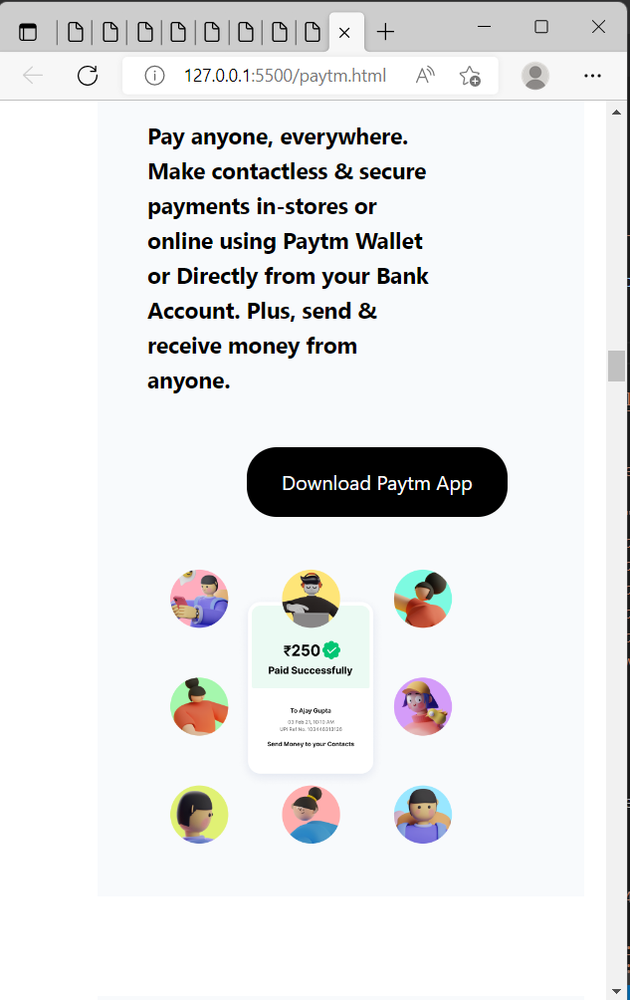

# Project Title : Paytm Clone

## About 

This was my first tailwind project to build Paytm Clone.

## What Did I Learn From This project

As this was my first Tailwind project, I learnt to use tailwind, the properties of Tailwind, to change the text size, to insert background image, background color, to insert images in tailwind, to set height and width.

## Time Taken To Finish The Project

Around 13 Hours.

## Screen Resolution

1920 * 750

#

## Project Final Look

#

